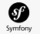

<h1 align="center"><strong>Challenge Backend4 Alura :heart: </strong></h1> 

<strong>Resumo do que foi proposto para este Chalenge:</strong>  
<strong>
Semana 1  
</strong>
Implementar uma API REST: implementar nela o CRUD de receitas e de despesas, seguindo algumas validações e regras de negócio,
implementar rotas para que sejam feitas requisicções HTTP, usar o Postman para testar estas requisições
Não pode repetir a mesma descrição de despesa e receita para o mesmo mês/ano, caso o usuário tente fazer isso,
é feita uma checagem e é devolvida uma mensagem avisando que isto não é permitido, e o post não é efetivado.
  

<strong>
Semana 2 
</strong>
Realizar ajustes na API: para permitir a categorização de despesas, além de implementar novas funcionalidades, como a busca de receitas e despesas pela descrição. Tambem é para fazer testes automatizados.   

<strong>
Semanas 3 e 4 
</strong>

Adicionar segurança na API: com a implementação de um mecanismo de autenticação, além  o deploy dela em algum provedor   

<strong>O que já fiz até hoje (quase final da ultima semana):</strong>

Criei o projeto usando o framework <strong>Symfony</strong>, e o gerenciador Doctrine para fazer o mapeamento de objetos para o banco de dados, facilitando a conexão e consultas com o banco. Implementei as rotas, e em cada uma delas está definida qual requisição pode ser feita.    

Criei as rotas pedidas, com as regras pedidas, criei a rota onde saem as despesas categorizadas, implementei a autenticação, tem uma rota que fica escondida, que cria o usuario, depois este usuario insere o nome e senha na rota de login, e é devolvido um token, que ele insere na aba Authorization, type: Bearer Token do Postman (não testei em outro programa mas deve ser parecido com o Postman), após inserir este token ele consegue acessar as demais rotas, a rota de login é a única que não exige que este token esteja inserido.
 Está feito o deploy, agora só falta estudar melhor a parte dos testes automatizados para tentar implementa-los, por enquanto fiz os testes manualmente e e está tudo funcionando conforme o pedido.
  

Obs: irei dar uma pausa de 1 semana neste projeto para me dedicar ao curso de tecnologo, estou em semana de provas, logo que passar a prova e eu ajeitar tudo la...volto a estudar a parte de testes automatizados e tento implementar no projeto...em seguida preciso fazer umas refatorações tambem  

<strong>Banco de dados:</strong> Criei banco de dados com 3 tabelas, uma pra armazenar as informações das despesas, outra para 
as despesas e mais uma para armazenar usuário e senha para autenticação. 

<strong>Criei as rotas pedidas que são estas abaixo:</strong>   
OBS: irei tentar melhorar estas urls...consequentemente deixando as rotas melhores e mais curtas...  
<strong>Rota de login</strong>:  
@Route("/login", name="app_login") 
https://apicontrolefinanceiro.crismgsp.com/controlefinanceiro/public/index.php/login 
Nesta rota o usuario insere os dados assim:  
pode utilizar o usuario abaixo caso queira testar:  
<pre>
{    
  </t>  "usuario": "usuario", 
  </t>  "senha" : "123456" 
}
</pre>
 
E envia um post, na resposta é retornado o token que ele irá inserir na autorização, no postman, marcar opção bearer token  
Apos inserir este token as requisicoes podem ser feitas:

<strong>Receitas</strong>:  
@Route("/receitas", methods={"POST"}, por enquanto está assim a rota: 
 <strong>https://apicontrolefinanceiro.crismgsp.com/controlefinanceiro/public/index.php/receitas</strong>  
 Esta rota é para o usuário inserir uma receita, usando o método POST   
  
 Exemplo de post em receitas: 
 <pre>
{    
        "descricao": "salario atualiza",
        "valor": 2400,
        "data": "08/07/2022"
}
</pre>
 
 @Route("/receitas", methods={"GET"}) 
<strong>https://apicontrolefinanceiro.crismgsp.com/controlefinanceiro/public/index.php/receitas</strong> 
Esta rota é para o usuário buscar informações de todas receitas, usando o método GET  

@Route("/receitas/{id}", methods={"GET"}): 
<strong>https://apicontrolefinanceiro.crismgsp.com/controlefinanceiro/public/index.php/receitas/id</strong>  
Esta rota é para o usuário buscar informações de uma receita, passando o seu id e usando o método GET  

@Route("/receitas/{id}", methods={"PUT"}): 
<strong>https://apicontrolefinanceiro.crismgsp.com/controlefinanceiro/public/index.php/receitas/id</strong>  
Esta rota é para o usuário atualizar informações de uma receita, passando o seu id e usando o método PUT  

@Route("/receitas/{id}", methods={"DELETE"}): 
<strong>https://apicontrolefinanceiro.crismgsp.com/controlefinanceiro/public/index.php/receitas/id</strong>  
Esta rota é para o usuário deletar informações de uma receita, passando o seu id e usando o método DELETE  

@Route("/receitas/descricao/{descricao}", methods={"GET"}) 
<strong>https://apicontrolefinanceiro.crismgsp.com/controlefinanceiro/public/index.php/receitas/descricao/salario</strong>  
Nesta rota o usuario pode buscar todas as receitas de acordo com uma descrição passada na url, e usando o GET  

@Route("/receitas/mes/{mesano}", methods={"GET"}) : 
<strong>https://apicontrolefinanceiro.crismgsp.com/controlefinanceiro/public/index.php/receitas/mes/mm-yyyy</strong>  
Nesta rota o usuario pode buscar todas as receitas de um mesmo mes(no mesmo ano), e usando o GET  

 

<strong>Despesas</strong>:  
@Route("/despesas", methods={"POST"} : 
 <strong>https://apicontrolefinanceiro.crismgsp.com/controlefinanceiro/public/index.php/despesas</strong>  
 Esta rota é para o usuário inserir uma despesa, usando o método POST   
  
 Exemplo de post em despesas: 
 <pre>
{    
        "descricao": "padaria",
        "valor": 12,
        "categoria": "alimentação",
        "data": "22/07/2022"
}
</pre>
 
 @Route("/despesas", methods={"GET"}), : 
<strong>https://apicontrolefinanceiro.crismgsp.com/controlefinanceiro/public/index.php/despesas</strong>  
Esta rota é para o usuário buscar informações de todas despesas, usando o método GET  

@Route("/despesas/{id}", methods={"GET"}),  abaixo segue um exemplo: 
<strong>https://apicontrolefinanceiro.crismgsp.com/controlefinanceiro/public/index.php/despesas/id</strong>  
Esta rota é para o usuário buscar informações de uma despesa, passando o seu id e usando o método GET  

@Route("/despesas/{id}", methods={"PUT"}),  abaixo segue um exemplo: 
<strong>https://apicontrolefinanceiro.crismgsp.com/controlefinanceiro/public/index.php/despesas/id</strong>  
Esta rota é para o usuário atualizar informações de uma despesa, passando o seu id e usando o método PUT  

@Route("/despesas/{id}", methods={"DELETE"}),  abaixo segue um exemplo: 
<strong>https://apicontrolefinanceiro.crismgsp.com/controlefinanceiro/public/index.php/despesas/id</strong>  
Esta rota é para o usuário deletar informações de uma despesa, passando o seu id e usando o método DELETE  

@Route("/despesas/descricao/{descricao}", methods={"GET"}), abaixo segue um exemplo: 
<strong>https://apicontrolefinanceiro.crismgsp.com/controlefinanceiro/public/index.php/despesas/descricao/papelaria</strong>  
Nesta rota o usuario pode buscar todas as despesas de acordo com uma descrição passada na url, e usando o GET  

@Route("/despesas/mes/{mesano}", methods={"GET"}), ficou assim localmente no meu computador: 
<strong>https://apicontrolefinanceiro.crismgsp.com/controlefinanceiro/public/index.php/despesas/mes/mm-yyyy</strong>  
Nesta rota o usuario pode buscar todas as despesas de um mesmo mes(no mesmo ano), e usando o GET  

 

<strong>Resumo mensal</strong>:  
@Route("/resumo/{mesano}", methods={"GET"} 
 <strong>https://apicontrolefinanceiro.crismgsp.com/controlefinanceiro/public/index.php/resumo/mm-yyyy</strong>  
  onde mm -> mês com 2 dígitos e yyyy é ano com 2 dígitos  
ao acessar esta rota de resumo mensal, utilizando o GET, obtem-se um resultado assim, por exemplo:  
O valor total das receitas do mês é 2700 
O saldo final do mês é 1640 
Valor total de despesas por categoria neste mês: 
Categoria  alimentação   -> Valor: 325 
Categoria  educação   -> Valor: 125 
Categoria  imprevistos   -> Valor: 40 
Categoria  lazer   -> Valor: 540 
Categoria  outras   -> Valor: 30 

<strong>Ferramentas e linguagens utilizadas até agora:</strong>

 PHP 

 Banco de dados MariaDB 

PHPMyAdmin (pra acessar o MariaDB)  

 Visual Studio Code 

 XAMPP   

 Composer   

 Symfony   

 Doctrine  

 Postman  

Referencias das imagens para credito:

PHP -> https://www.flaticon.com/br/icones-gratis/php

 

